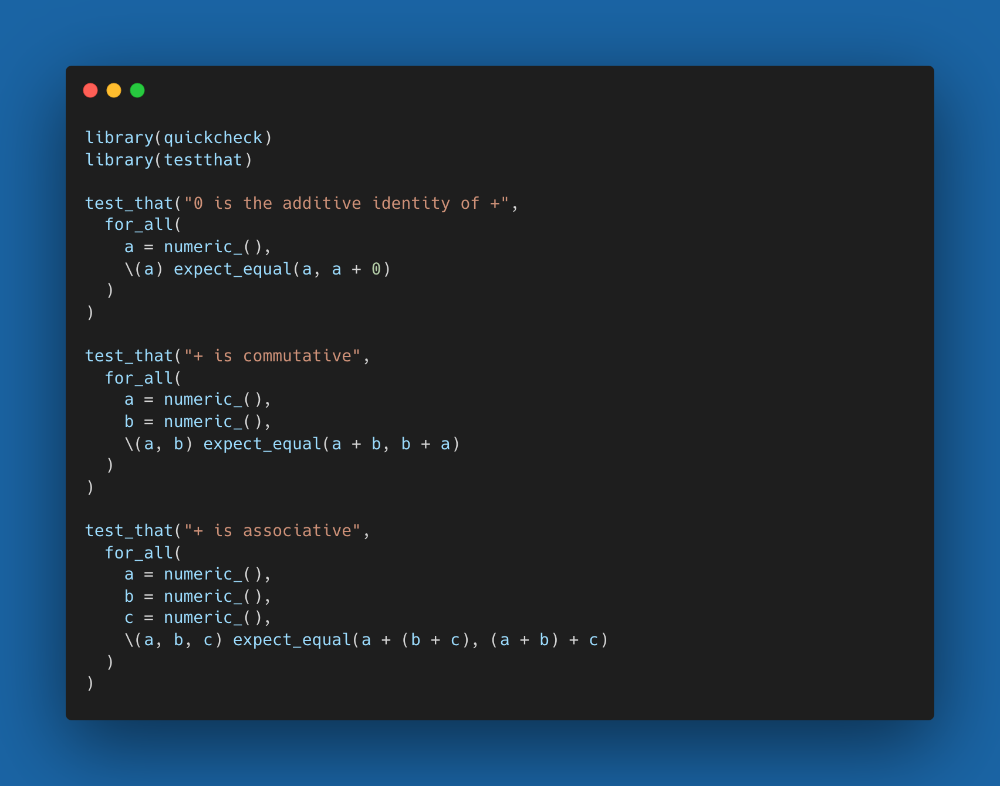

<!-- README.md is generated from README.Rmd. Please edit that file -->

# quickcheck

<!-- badges: start -->
<!-- badges: end -->

# Overview

Property based testing in R, inspired by
[Quickcheck](https://en.wikipedia.org/wiki/QuickCheck). This package
builds on the property based testing framework provided by
[`hedgehog`](https://github.com/hedgehogqa/r-hedgehog) and is designed
to seamlessly integrate with a [`testthat`](https://testthat.r-lib.org).

## Installation

You can install the development version of quickcheck from
[GitHub](https://github.com/) with:

``` r
# install.packages("remotes")
remotes::install_github("armcn/quickcheck")
```

# Usage

The following example uses quickcheck to test the properties of the base
R `+` function.
[Here](https://fsharpforfunandprofit.com/posts/property-based-testing/)
is an introduction to the concept of property based testing, and an
explanation of the mathematical properties of addition can be found
[here](https://www.khanacademy.org/math/cc-sixth-grade-math/cc-6th-factors-and-multiples/properties-of-numbers/a/properties-of-addition).


